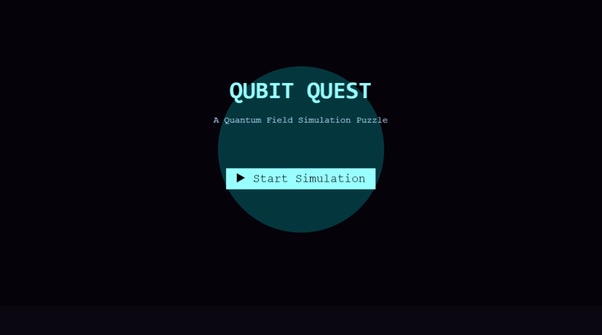
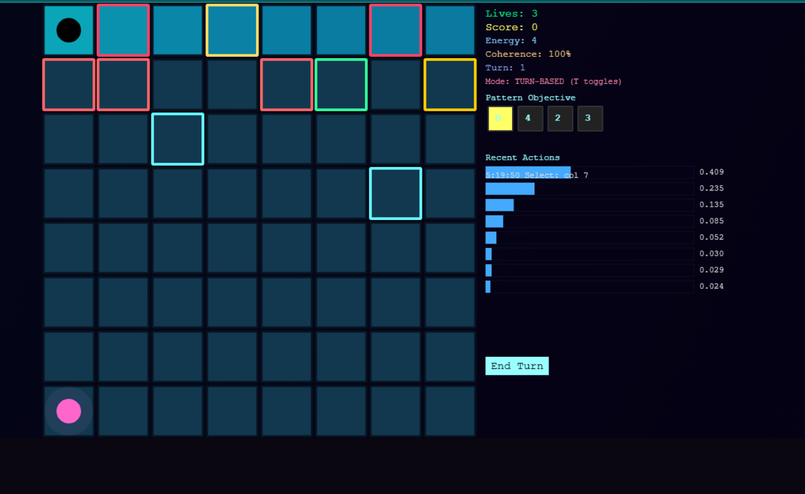

# ⚛ QUBIT QUEST — The Quantum Field Simulation Puzzle

*Qubit Quest* is an interactive *quantum puzzle game* that fuses strategy, physics, and aesthetic minimalism.  
It visualizes *superposition, **entanglement, and **wave-function collapse* through a neon grid powered by *Phaser 3, with real quantum walk simulations executed on a **FastAPI + NumPy* backend.



---

## Installation & Local Setup Guide

Follow these steps to run *Qubit Quest* on your local machine.

---

### 1️⃣ Clone the Repository
```bash
git clone https://github.com/aaron1-z/Qubit-Quest.git
cd Qubit-Quest
```

### 2️⃣ Install Node.js Dependencies
```bash
Make sure you have Node.js (v18 or newer) and npm installed.

npm install
```

This installs all required dependencies and sets up the concurrent runner to launch both backend and frontend together.
---

 ### 3️⃣ Install Python Dependencies
```bash
Ensure Python 3.9+ is installed.
Then run:

cd backend
pip install -r requirements.txt
cd ..

(Optional but recommended: use a virtual environment)

python -m venv venv
venv\Scripts\activate     # On Windows
source venv/bin/activate  # On macOS/Linux
```


---

### 4️⃣ Run in Development Mode
```bash
To launch both backend and frontend together:

npm start
```


## Gameplay Overview

You are the *Observer* of a simulated quantum field.  
Your task is to *collapse* a superposed field *coherently* — aligning quantum amplitudes to match the *Pattern Objective* before the system decoheres.

Every tile is a *quantum position, every move a **measurement, and every decision a test of your control over the most unpredictable force in the universe — **probability*.

If coherence collapses to 0%, the field decoheres irreversibly, and the simulation ends.

---

##  How to Play

### Objective
- Observe the *Pattern Objective* sequence on the right panel (the glowing numbers).  
- Manipulate the field (the blue grid) using *quantum operations*.  
- Preserve *Energy* and *Coherence* while guiding the field toward the desired pattern.  
- Achieve a coherent collapse to score and progress.

---

###  Controls

| Action | Key / Input | Description |
|--------|--------------|-------------|
|    *Select Column* | Click any tile | Chooses a column to manipulate |
|    *Apply Phase* | Q | Stabilizes the selected amplitude (uses 1 Energy) |
|    *Apply Hadamard* | H | Creates a superposition mix of amplitudes (uses 2 Energy) |
|   *Peek* | E | Reveals the column with highest probability (uses 1 Energy) |
|   *Measure / Collapse* | SPACE | Collapses the wave function — outcome depends on coherence |
|   *Entangle* | SHIFT + Click two tiles | Links columns; changing one affects the other |
|   *End Turn* | Button | Advances the quantum step and triggers random field events |
|   *Restart* | R or Restart Button | Reboots the simulation with new initial amplitudes |
|   *Toggle Mode* | T | Switch between *Turn-Based* and *Real-Time* evolution |
|   *Toggle Log* | L | Opens the Quantum Log — shows your field history |

---

##  Understanding the Interface

The game grid is a *quantum state-space*, and every element on screen has meaning:

###  1. The Grid
- Each *square* (tile) represents a *quantum position* in the field.  
- Its *color brightness* shows *amplitude strength* — brighter tiles have higher probability of collapse.  
- During each turn, operations modify these amplitudes via Hadamard and Phase transformations.

###   2. The Black Orb — “Observer Particle”
- Represents the *collapse agent* — the measuring observer.  
- Appears at the top left or moves across active columns as you perform actions.  
- When you measure (SPACE), this orb symbolizes the *act of observation*, collapsing the wave function to a classical outcome.  
- Its movement and flicker reflect the *probabilistic chaos* of quantum measurement.

###   3. The Pink Orb — “Quantum Source Field”
- Anchored at the lower-left corner of the grid.  
- Symbolizes *global coherence* — the energy keeping your quantum field stable.  
- Its glow intensity corresponds to your *Coherence %* on the panel.  
  - At 100%, it emits a steady, pulsating glow.  
  - As coherence drops, it dims — representing decoherence and entropy.  
- When coherence reaches 0%, it fades completely — and the quantum field collapses.

###  4. The Right Panel — Quantum HUD
Displays your current simulation status.

| Element | Meaning |
|----------|----------|
| *Lives* | Remaining decoherence thresholds — lose all, and the field destabilizes permanently. |
| *Score* | Points gained for successful coherent collapses. |
| *Energy* | Quantum energy available for operations (H, Q, E). Recharges slowly on success. |
| *Coherence* | Field stability. Decreases with randomness and failed collapses. |
| *Turn* | Simulation step count — each End Turn evolves the system one quantum tick. |
| *Mode* | Either TURN-BASED or REAL-TIME. Toggle with T. |
| *Pattern Objective* | Target sequence you must reproduce via coherent collapse. Each number corresponds to a column. |

###  5. Recent Actions Log
- Chronologically records your quantum operations.  
- Each entry logs:
  - Timestamp
  - Action type (e.g., Hadamard on col 4, Measure, Collapse Success)  
  - Probability distribution value (to the right) — a normalized amplitude strength indicator.  
- The blue horizontal bars visualize *quantum probability density* — a histogram of recent outcomes.  

---



##   Quantum Mechanics in the Gameplay

###  1. *Superposition*
When you apply the *Hadamard gate (H)*, each column enters a mixed state — amplitude spreads across the grid.  
The visual glow represents *interference* — overlapping probability waves.

###  2. *Entanglement*
Entangled tiles share quantum information — performing operations on one affects its pair.  
This simulates *non-locality*, where two distant qubits behave as one.

###  3. *Quantum Walks*
The backend simulates *discrete-time quantum walks*, where amplitudes propagate bidirectionally with each step.  
NumPy matrices handle the *Hadamard, **biased, and **custom coin* gates, evolving the field unitary.

###  4. *Decoherence*
Noise enters the system after each move.  
Excessive operations reduce *Coherence %*, increasing collapse randomness.  
It visualizes how quantum systems lose information through observation or entropy.

###  5. *Measurement*
When you press SPACE, the system collapses based on weighted probabilities.  
If coherence is high, collapse aligns with your *Pattern Objective*, rewarding points and restoring energy.  
If coherence is low, collapse fails — decoherence spreads, the pink orb fades, and energy drains.

---

## ⚙ Architecture Overview

###  Backend — FastAPI Quantum Engine
- Path: /backend/app/
- Endpoint: /api/qwalk
- Simulates *quantum walks* using NumPy
- Returns normalized probability amplitudes to the frontend

*Stack*
- FastAPI — async quantum simulation API  
- NumPy — vectorized amplitude evolution  
- Qiskit (future) — integration for live quantum execution

---

###  Frontend — Phaser Quantum Grid
- Path: /frontend/src/
- Built with *Phaser 3* and *Parcel 2*
- Components:
  - QuantumEngine.js — handles local amplitude dynamics
  - api.js — fetches backend quantum walk data
  - main.js — controls all visuals, interactions, and scenes

---
